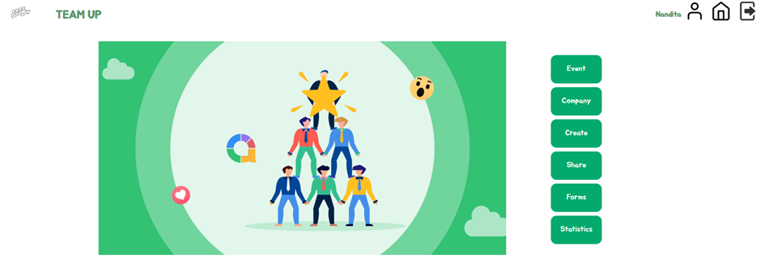

# INSTALLATIEHANDLEIDING
# TEAM UP

## INHOUD
1. Inleiding

2. Installatie
- Webstorm
- Node.js
- Nodemon

3. Orientate

4. Opbouw van pagina's
- Inloggen en registreren
- Home
- navBar
- Profiel
- Event
- Company
- Creat
- Share
- Forms
- Statistics

## 1. Inleiding
Team up is een applicatie die evnementenbureau's het werk uit handen neemt en overzicht creëert.
In deze applicatie kunnen de klanten eenvoudig worden vastgelegd en hun gegevens worden bijgehouden,
evenementen kunnen worden opgevraagd aan de hand van verschillende criteria, een planning kan worden
bijgehouden, contact met klanten onderhouden worden en statistieken worden geraadpleegd.

## 2. Installatie
Om aan de slag te gaan, zijn er van tevoren een aantal instellingen die moeten worden uitgevoerd op
de applicatie te kunnen bekijken. Hier onder staat stapsgewijs uitgelegd wat je moet doen.

### Webstorm
Om de zoekopdrachten uit te kunnen voeren heb je een API-Key nodig. Dit installeer je in de
bestaande mappenstructuur op de volgende wijze;

1. Klik met je rechter muisknop op de map 'src'.
2. Kies 'New
3. Selecteer 'JavaScript File'
4. Noem het key
5. Druk op 'Enter' 
6. Als je de vraag krijgt of je het aan Git wil toevoegen kies voor 'Cancel'
7. in key.js bestand plak je de volgende code:
   `export const API_KEY = "lOyeYPGObRJOyEa04BCuqeLkaZT3eAU6awWAqqJ8"`

verder zijn er nog wat andere installaties die nodig zijn om het project te kunnen bekijken:

### Node.js
Node.je is een JavaScript-runtime die wordt gebruikt bij het bouwen van web toepassingen 
Hiermee toon je wat je hebt gemaakt met de geschreven code tot dan toe.

Je kunt Node.js en npm installeren met de volgende stappen;

1. Ga naar de officiële Node.js website: https://nodejs.org/.
2. Klik op de downloadknop voor de aanbevolen versie voor je besturingssysteem. 
3. Dubbelklik op het gedownloade bestand en volg de instructie op de installatiewizard.
4. Nadat Node.js is geïnstalleerd, open je de terminal en voer je het commando `node -v` uit
om te controleren of Node.js correct is geïnstalleerd. Het commando geeft de versie van Node.js weer.

## Nodemon
Nodemon is een hulpmiddel dat het ontwikkelingsproces versnelt door automatisch wijziging in je code
te detecteren en je applicatie opnieuw op te starten, waardoor je niet steeds zelf hoeft te doen.

Je kunt Nodemon installeren via de stappenplan:

1. Open je terminal
2. Voer het volgende commando in: npm install nodemon```
3. Wacht tot de installatie is voltooid
4. Nodemon is nu geïnstalleerden en klaar voor het gebruik in het project
5. Bekijk met de volgende commando de app: `nmp start`

## 3. Oriëntatie
Voordat de tour door de applicatie begint, leg ik graag de plattegrond van de applicatie uit.
Hier onder zie je de startpagina ofwel 'Home'. Via deze pagina kan je eenvoudig naar alle richtingen
ofwel functionaliteiten van het programma genavigeerd worden. Het middelste gedeelte is eigenlijk de 
'Home' pagina, en de groen knoppen zijn de functionaliteiten rondom het
klantenbestand. De navigatiebalk, dat is de strook boven aan de pagina, wat overigens op elke
pagina staat nadat je bent ingelogd. De opbouw hiervan wordt later uitgebreid onder 'navBar' 
toegelicht. Maar weet dat het icoontje van het huisje je altijd weer thuis brengt naar de 'home' pagina.



## 3. Opbouw van de pagina's
In dit onderdeel worden de functionaliteiten per onderdeel van de applicatie doorgenomen.

### Inloggen en Registreren
Om toegang te kunnen krijgen tot de applicatie kan je je eerst registreren. Het programma 
start altijd op de inlogpagina, maar als je op het woord 'Registreer' klikt, wordt je naar 
waar je een email, gebruikersnaam, en wachtwoord moet opgeven. Let op het wachtwoord moet minimaal
6 karakters bevatten. Kies de rol 'User' en 'Sign Up' maar.

Wanneer je een uniek combinatie hebt aangemaakt, kom je weer vanzelf weer op de inlogpagina en kan
je de net aangemaakte combinatie invoeren. Als dit correct is ingevoerd kom je uit op de
startpagina, ofwel de 'Home' pagina.

### Home
De 'Home' pagina bestaat uit twee gedeelten, namelijk de navigatiebalk bovenin die ik verder
voor het gemak de 'navBar' zal noemen wat gelijknamig is met de  benaming van het component.
Uitleg hier over in de volgende paragraaf. 

De groen buttons in het kort:

- **Event**: Dit is de plek waar je geplande evenementen kan zien en zelf nieuwe inplannen
- **Company***: Hier kan je gegevens van bestaande klanten inzien
- **Create**: Zoekopdrachten en een nieuwe bedrijfsprofiel kan hier gecreëerd worden.
- **Share**: Chat met de klant
- **Forms**: Maak hier standaardbrieven en formulieren aan en download ze
- **Statistics**: Bekijk hier het functioneren van de organisatie en medewerkers

### navBar
Dit is de basis van je applicatie. Deze navBar navigeert je te alle tijden naar je eigen
profielpagina via het 'mens' icoontje. 
Terwijl het 'huis' icoontje je altijd weer thuis brengt op de 'Home' pagina als
je verdwaald bent.
'out-of-the-box' icoon is de uitlogknop die je weer naar de inlogpagina stuurt. Om vanuit daar weer
naar de 'Home' pagina te komen, moet je natuurlijk weer inloggen. 

### Profiel
Als je het 'mens' icoon naast je gebruikersnaam benadert, kom je uit op je peroonlijke
pagina. Hier kan je je profielfoto instellen en je wachtwoord wijzigen. Momenteel wordt er
nog geen gebruik gemaakt van een backend die deze wijzigingen onthoudt en opslaat, maar
zodra dit gekoppeld is blijft dit staan. Verder kan je zien welke klanten aan jou profiel
zijn gekoppeld, zodat je eenvoudig de klantenbestanden kan benaderen die op jou betrekking hebben.

### Event
Hier zal je de planning van de evenementen kunnen vinden. Het is een kalender waar je zowel
je eigen evenementen zal kunnen zien als dat van je collega's. Niet alleen zien, maar
ze natuurlijk ook aanmaken. Door op een dag te klikken verschijnt een invulveld om de tijd en titel 
van jou evenement in te kunnen vullen. Links boven aan de pagina zie je in welke maand
je aan het koekeloeren bent en met de pijltjes rechts bovenin kan je naar andere maand switchen. 
Dit onderdeel is onder constructie en slaat gegevens nog niet op, maar zodra de backend in werking 
is, zal deze functionaliteit in gebruik genomen kunnen worden.

### Company
Er is alvast een opzet gemaakt voor de opbouw van het bedrijfsprofiel (CompanyProfile). Maar om
je een beeld te geven van de komende functionaliteiten;

- **Detail**: NAW gegevens van de organisatie
- **Event**: Afspraken en planning rondom het lopende evenement
- **History**: Evenementen uit het verleden, kan als uitgangspunt gelden
- **Finance**: Alles rondom prijsafspraken en facturatie
- **Forms**: Vastgelegde documenten en templates zoals contracten en evaluaties

### Create
Dit is de plek waar je een evenement kan zoeken 'Create Event' en nieuwe klant kan aanmaken. Dat 
laatste is nog onder constructie en zal ju voor nu naar een bedrijfspagina 'Company' brengen. 

'Create Event' biedt je de mogelijkheid om via de https://predicthq.com API, evenementen op te halen.
Er zijn vier verplichte velden;

- **Category**: Dit is een dropdown met beschikbare categorieën 
- **Location**: Voer hier een plaatsnaam in
- **Start**: start datum
- **End**: Eind datum

De velden 'Whitin', waarbij je de straal waarbinnen je een evenementen in kilometers wil zoeken, kan opgeven, 
en 'Limit', waarbij je het aantal gevonden resultaten kan bepalen, staat al sowieso standaard iets 
ingevuld.

Als je alle criteria hebt opgegeven en op de 'Search' knop klikt, verschijnen er resultaten in 
blokken onder elkaar. In een resultaten blok zie je de naam van het evenement, de categorie, eventueel 
de labels die iets meer over het evenement vertellen en start- en einddatum. ALs je meer informatie wil 
over het evenement kan je de naam en eventueel de categorie selecteren en vervolgens op 'zoeken' klikken.
Dan wordt erin een zijscherm op het web gezocht naar dit evenement en kan je meer te weten komen.

### Share
Dit is een Chat widget waar je gesprekken met klanten kan voeren. Let op de chat staat rechts
onder aan de pagina en moet nog worden geopend.

### Forms
Onder constructie

### Statistics 
Onder constructie